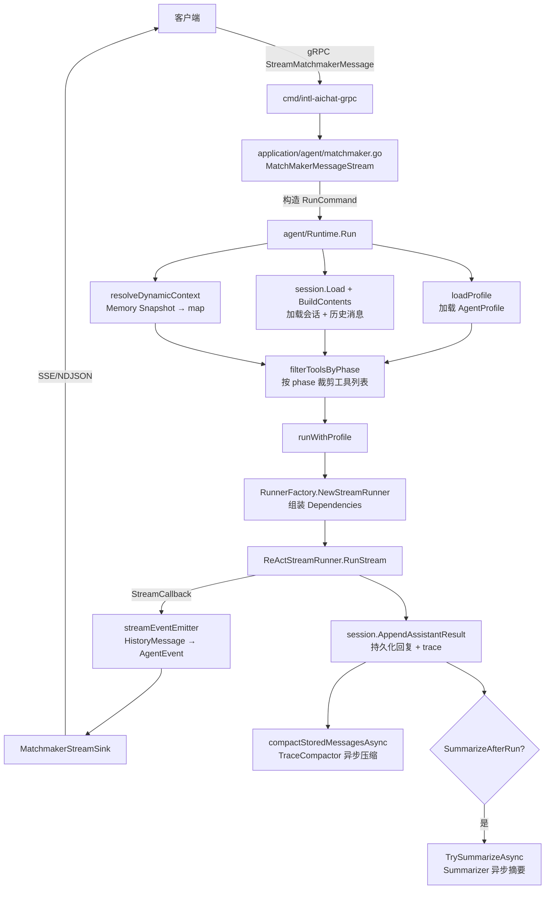
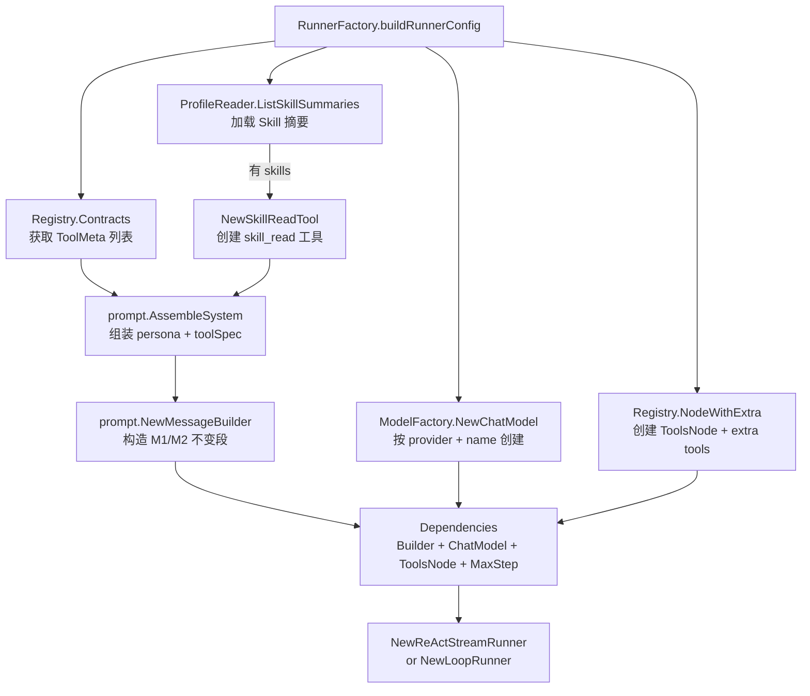
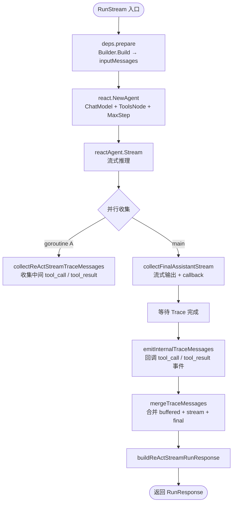
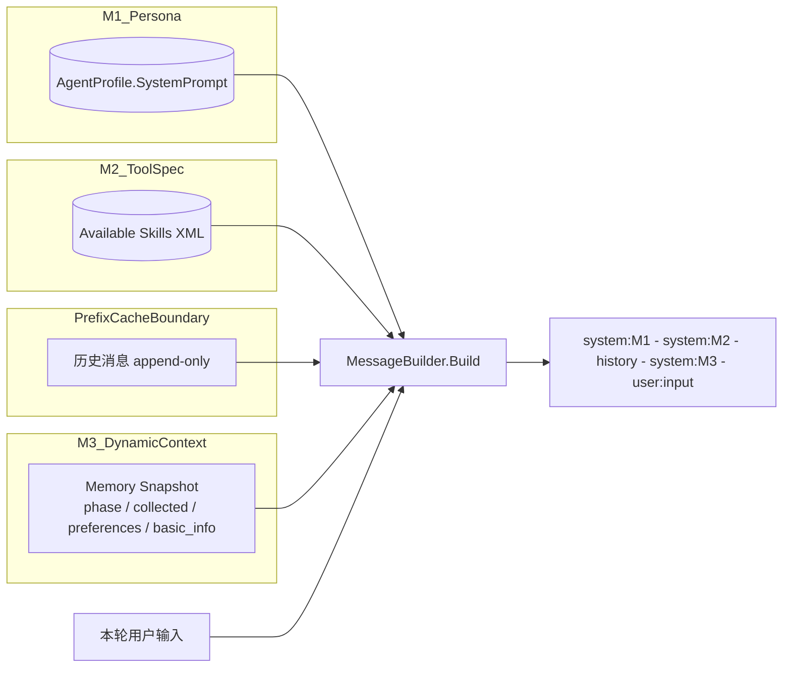
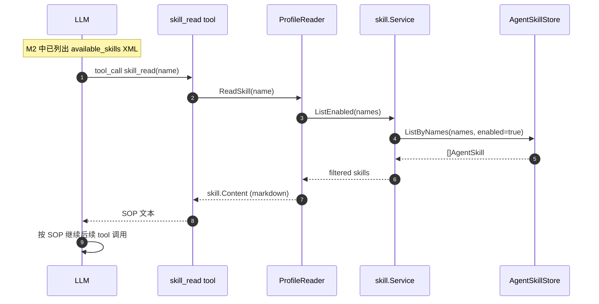
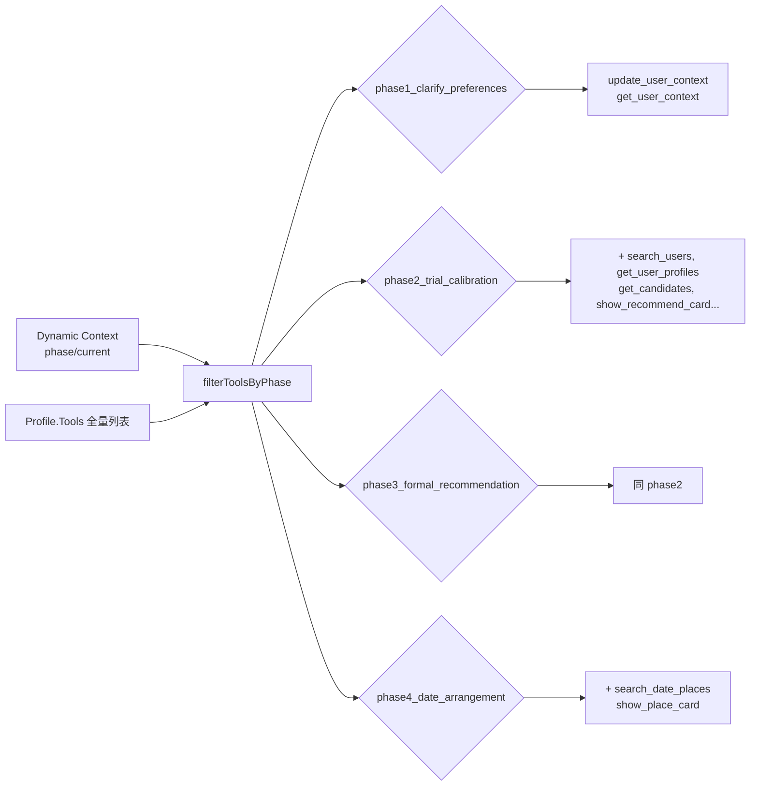
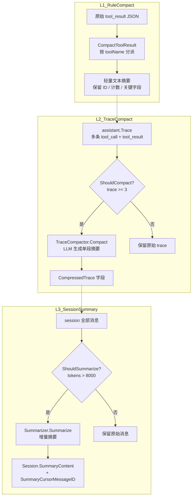
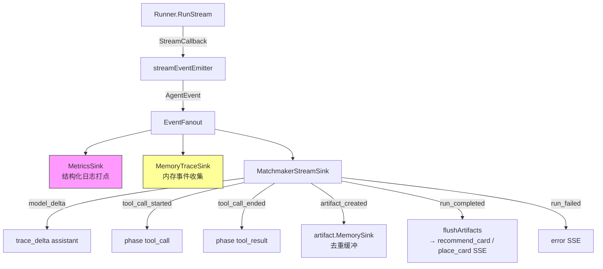
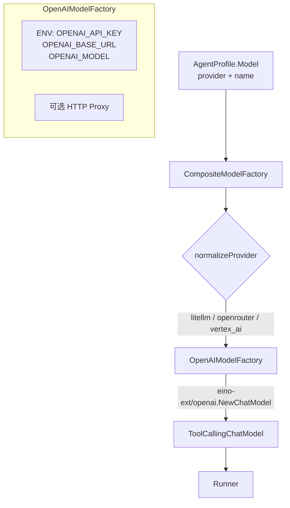
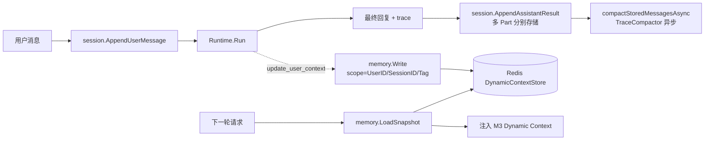

# Agent 架构总结

> 本文聚焦 `intl-aichat` 仓库内 Agent 引擎的运行时架构与关键流程，配合 Mermaid 流程图。
> 偏功能视角的说明见 `doc/matchmaker-agent-overview.md`。

## 一、整体分层

```
cmd/                          # HTTP / gRPC / worker 入口
  └── intl-aichat-grpc, intl-aichat-rest, intl-aichat-worker

application/agent/            # 业务编排层
  ├── matchmaker.go           # 红娘会话（同步 + 流式）
  ├── coach.go                # Coach 分析 / 对话
  └── init.go                 # Container / Factory 装配

service/einoagent/            # Agent 运行时
  ├── agent/                  # 核心调度
  │   ├── runtime.go          # 总调度（Profile + Session + Memory + Runner）
  │   ├── factory.go          # RunnerFactory（组装 Runner 依赖）
  │   ├── events.go           # StreamEventEmitter（HistoryMessage → AgentEvent 转换）
  │   ├── matchmaker_stream_sink.go  # MatchmakerStreamSink（AgentEvent → SSE 适配）
  │   └── replay.go           # Replay / Eval（历史对话重放评估）
  ├── runner/                 # ReAct 主循环
  │   ├── types.go            # Runner / StreamingRunner 接口，RunRequest / RunResponse
  │   ├── common.go           # Dependencies、prepare、buildRunResponse、消息转换
  │   ├── react_stream_runner.go  # ReActStreamRunner（流式 ReAct）
  │   ├── loop.go             # LoopRunner（同步 / 可选流式 ReAct）
  │   └── litellm.go          # reactAgentOptions（litellm_session_id 注入）
  ├── prompt/                 # System Prompt 拼装
  │   ├── builder.go          # MessageBuilder（M1/M2/M3 三段布局）、AssembleSystem
  │   └── contract.go         # BuildToolContract（工具使用契约渲染）
  ├── tools/                  # 工具注册与元数据
  │   ├── registry.go         # Registry（工具注册表）、NewDefaultRegistry
  │   ├── toolset.go          # Toolset 接口、StaticToolset、ToolSource 常量
  │   ├── node.go             # Node（Eino ToolsNodeConfig 封装 + 日志中间件）
  │   ├── meta.go             # ToolMeta / ToolWithMeta 类型 re-export
  │   └── impl/               # 工具实现（见下文工具清单）
  ├── skill/                  # Skill SOP 服务
  │   └── service.go          # Service（读取）、ManagementService（CRUD）、ProfileReader
  ├── session/                # 会话与消息持久化
  │   └── service.go          # Service 接口、DefaultService
  ├── memory/                 # 用户/会话级动态上下文
  │   └── memory.go           # Service 接口、Scope / Snapshot / Write
  ├── model/                  # ModelFactory（多 provider 抽象）
  │   └── chatmodel.go        # CompositeModelFactory、OpenAIModelFactory
  ├── summarizer/             # 历史压缩（三层压缩）
  │   ├── summarizer.go       # Summarizer（对话级摘要 - 跨轮次压缩）
  │   ├── trace_compactor.go  # TraceCompactor（单轮 trace LLM 压缩）
  │   ├── tool_result_compactor.go  # CompactToolResult（单工具结果规则压缩）
  │   ├── expand.go           # ExpandForAgentContext / ExpandForSummary（DB → schema.Message）
  │   └── token.go            # CountTokens
  ├── event/                  # 事件系统
  │   ├── events.go           # AgentEvent / EventSink / EventFanout 定义
  │   ├── metrics_sink.go     # MetricsSink（结构化日志打点）
  │   └── trace_sink.go       # MemoryTraceSink（内存事件收集，用于 Replay）
  ├── artifact/               # Artifact 收集
  │   └── sink.go             # MemorySink（去重缓冲，RunCompleted 时 flush）
  └── runtime/                # 类型别名 re-export（对外暴露简洁入口）
      └── runtime.go

service/ai/                   # 底层 LLM 客户端（未使用独立 provider 文件，统一经 OpenAI-compat）
common/store, common/inner    # 存储接口与领域模型
prompts/                      # matchmaker 主提示 + 各 Skill SOP
```

## 二、核心组件

| 组件 | 路径 | 关键 API |
|------|------|---------|
| Runtime | `agent/runtime.go` | `NewRuntime`, `Run`, `Replay` |
| RunnerFactory | `agent/factory.go` | `NewRunner`, `NewStreamRunner`, `buildRunnerConfig` |
| ReAct 流式 Runner | `runner/react_stream_runner.go` | `RunStream` |
| Loop Runner | `runner/loop.go` | `Run`, `RunStream` |
| Prompt Builder | `prompt/builder.go` | `NewMessageBuilder`, `Build`, `AssembleSystem` |
| Tool Contract | `prompt/contract.go` | `BuildToolContract`, `BuildAvailableSkills` |
| Tool Registry | `tools/registry.go` | `NewDefaultRegistry`, `NodeWithExtra`, `Contracts` |
| Tool Node | `tools/node.go` | `Config`（注入日志中间件） |
| Skill Service | `skill/service.go` | `ListEnabled`, `Read`, `Upsert`, `SetEnabled` |
| Profile Reader | `skill/service.go` | `NewProfileReader`, `ReadSkill`, `ListSkillSummaries` |
| Session Service | `session/service.go` | `Create`, `Load`, `AppendUserMessage`, `AppendAssistantResult`, `BuildContents`, `TrySummarizeAsync` |
| Memory | `memory/memory.go` | `LoadSnapshot`, `Write`, `Search` |
| Model Factory | `model/chatmodel.go` | `CompositeModelFactory`, `OpenAIModelFactory` |
| Summarizer | `summarizer/summarizer.go` | `ShouldSummarize`, `Summarize` |
| TraceCompactor | `summarizer/trace_compactor.go` | `ShouldCompact`, `Compact` |
| Tool Result Compactor | `summarizer/tool_result_compactor.go` | `CompactToolResult` |
| EventSink | `event/events.go` | `EventSink`, `EventFanout`, `EventSinkFunc` |
| MetricsSink | `event/metrics_sink.go` | `Emit`（结构化日志打点） |
| TraceSink | `event/trace_sink.go` | `Emit`, `Events`, `HistoryMessages` |
| Artifact Sink | `artifact/sink.go` | `MemorySink`, `Add`, `List` |
| StreamEventEmitter | `agent/events.go` | `emitHistoryMessage`（HistoryMessage → 结构化 AgentEvent） |
| MatchmakerStreamSink | `agent/matchmaker_stream_sink.go` | `Emit`（AgentEvent → MatchMakerStreamEvent SSE） |

## 三、工具清单

### Local 工具（ToolSourceLocal）

| 工具名 | 文件 | 功能 | Artifact |
|--------|------|------|----------|
| `search_users` | `impl/search_users.go` | 按结构化条件搜索 ES 用户索引，返回轻量初筛摘要 | — |
| `get_user_profiles` | `impl/get_user_profile.go` | 按 user_id 批量查询完整资料（基本信息、tags、search_hints） | — |
| `get_candidates` | `impl/get_candidates.go` | 获取系统推荐候选人列表 | — |
| `get_swipe_history` | `impl/get_swipe_history.go` | 查询用户滑动匹配历史 | — |
| `get_chat_activity` | `impl/get_chat_activity.go` | 查询用户聊天活跃度 | — |
| `get_avatar_features` | `impl/get_avatar_features.go` | 获取用户头像特征评分 | — |
| `es_query` | `impl/es_query.go` | 通用 ES 查询工具 | — |
| `es_describe_schema` | `impl/es_schema.go` | 查看 ES 索引字段定义 | — |
| `show_recommend_card` | `impl/show_recommend_card.go` | 展示候选人推荐卡片，自动拉取真实资料合并渲染 | `recommend_card` |
| `search_date_places` | `impl/search_date_places.go` | Google Places API 搜索约会场所 | — |
| `show_place_card` | `impl/show_place_card.go` | 展示地点推荐卡片（地址、评分、地图链接） | `place_card` |

### Memory 工具（ToolSourceMemory）

| 工具名 | 文件 | 功能 |
|--------|------|------|
| `get_user_context` | `impl/get_user_context.go` | 读取用户动态上下文 |
| `update_user_context` | `impl/update_user_context.go` | 写入/更新用户动态上下文 |

### Skill 工具（ToolSourceSkill，动态注入）

| 工具名 | 文件 | 功能 |
|--------|------|------|
| `skill_read` | `impl/skill_read.go` | 按名称读取 Skill SOP markdown 内容 |

## 四、关键流程图

### 1. 端到端请求链路（流式发消息）



### 2. RunnerFactory 依赖组装



### 3. ReAct 主循环（ReActStreamRunner）



### 4. System Prompt 三段布局（M1 / M2 / M3）



> **设计意图**：M1 + M2 在同一 profile 版本内字节稳定，可命中 provider 侧 prefix cache；M3 以独立 system message + `<dynamic_context>` XML 包裹注入，不影响缓存前缀。
>
> **实验状态**：Tool Contract 段（`BuildToolContract`）当前通过 prompt-ablation 实验关闭，验证 LLM 仅依靠 tools JSON schema 是否足够路由工具调用。Available Skills 段保留。

### 5. Skill 加载（运行时按需读取）



### 6. Phase 工具过滤



> 未识别的 phase 或空值不做过滤，返回完整工具列表。`skill_read` 作为 extraTool 注入，不受 phase 过滤控制。

### 7. 三层历史压缩



> **L1** 在 `ExpandForAgentContext` 时对每条 tool_result 做规则压缩，去除冗余 JSON 只保留关键字段。
> **L2** 在 `AppendAssistantResult` 后异步触发，当单条消息的 trace 条数 ≥ 3 时用 LLM 压缩为一段总结，存入 `CompressedTrace` 字段。下次构建历史时直接用 `CompressedTrace` 替代原始 trace 展开。
> **L3** 在 `TrySummarizeAsync` 中触发，当累积 token 数超过阈值（默认 8000）时，保留最近 3 轮用户消息的原始内容，之前的部分用 LLM 压缩为增量摘要。

### 8. 事件流与 Artifact 系统



> **Artifact 双链路**：工具执行时通过 `StreamEmitterFromCtx` 直接 emit 前端事件（如 `recommend_card`）；同时 `streamEventEmitter` 解析 tool_result 中的 `card` 字段创建 `Artifact`，由 `MatchmakerStreamSink` 收集后在 `run_completed` 时统一 flush（兜底保障）。

### 9. Model Factory



> 当前生产链路统一走 OpenAI-compatible 协议，通过 `OPENAI_BASE_URL` 指向 LiteLLM 网关或直连 OpenAI / OpenRouter。`openrouter` 和 `vertex_ai` provider 自动归一化为 `litellm`。

### 10. Session 与 Memory 写入



> Session 消息支持多 Part 存储（`AssistantPart`），每个 Part 独立包含 `Content` + `Trace`，对应一次工具调用循环后的文本输出。

## 五、关键设计点

1. **Eino ReAct 框架**：依赖 `cloudwego/eino` 的 `react.Agent`，支持 `Generate`（同步）和 `Stream`（流式）两种模式。工具通过 `compose.ToolsNodeConfig` 注入，配置 `ExecuteSequentially` 保证工具按序执行。

2. **Prompt 三段缓存优化**：System Prompt 分为 M1（persona）、M2（tool spec / skills）、M3（dynamic context）三段。M1 + M2 在同一 profile 版本内字节稳定，利用 provider 侧 prefix cache 降低首 token 延迟；M3 和用户输入每轮变化，置于缓存边界之后。

3. **Phase 工具过滤**：`phaseToolAllowlist` 定义四阶段可用工具白名单。phase1 仅开放 context 工具，phase2/3 增加搜索和推荐工具，phase4 额外开放地点工具。未识别 phase 不做过滤。

4. **三层历史压缩**：L1 规则压缩（`CompactToolResult`，按工具名分派，无 LLM 调用）→ L2 单轮 trace LLM 压缩（`TraceCompactor`，异步执行，阈值 ≥ 3 条 trace）→ L3 跨轮次对话摘要（`Summarizer`，异步执行，token 阈值 8000）。三层协同控制上下文窗口增长。

5. **Metadata 驱动 Tool Contract**：每个工具在 `ToolMeta` 中声明 `WhenToUse / Avoid / Antipattern / Output / SideEffect / ParallelSafe / Requires / ArtifactKind`，由 `BuildToolContract` 渲染进系统提示（当前实验性关闭）。

6. **Toolset 分组注册**：工具按来源分为 `local`（业务工具）、`memory`（上下文读写）、`skill`（动态注入的 `skill_read`）三类，通过 `Toolset` 接口统一注册到 `Registry`，Profile 的 `Tools` 字段做白名单控制。

7. **事件流三通道**：内部 `StreamCallback` 产生 `HistoryMessage`，由 `streamEventEmitter` 转为结构化 `AgentEvent`，经 `EventFanout` 分发到 `MetricsSink`（打点）、`MemoryTraceSink`（Replay）、`MatchmakerStreamSink`（前端 SSE）三个通道。

8. **Artifact 去重与 Flush**：`MemorySink` 按 ID / payload 去重缓冲 Artifact，在 `run_completed` 事件时统一 flush 到 SSE 流，确保 `recommend_card` / `place_card` 事件不丢不重。

9. **Replay / Eval**：`Runtime.Replay` 复用历史 Session 的前 N 轮消息作为 context，重放最后一条用户输入，用于 profile 版本对比和回归测试。

10. **Skill CRUD 管理**：`ManagementService` 支持 Skill 的列表、查询、创建/更新（`Upsert`）和启停（`SetEnabled`），content hash 校验防止重复写入。

## 六、扩展指引（速查）

| 想做的事 | 改哪里 |
|---------|-------|
| 新增一个工具 | `tools/impl/xxx.go` 实现 + `tools/registry.go` 的 `newLocalTools` 注册；声明 `ToolMeta` |
| 新增一个 Skill SOP | 通过 `ManagementService.Upsert` 写入 DB（AgentSkill 表），设 `enabled=true` |
| 接入新 LLM Provider | `model/chatmodel.go` 新增 `ProviderFactory` 实现，注册到 `CompositeModelFactory` |
| 修改 Persona | 修改 Profile 对应的 `SystemPrompt` 字段（DB 或 `prompts/matchmaker_en.md`） |
| 调整动态上下文字段 | `agent/runtime.go: resolveDynamicContext` + `prompt/builder.go: BuildDynamicSection` |
| 新加 Stream 事件类型 | `event/events.go` 新增 `AgentEventType`，`agent/events.go` 新增 emit 方法，`matchmaker_stream_sink.go` 适配 |
| 调整历史压缩策略 | L1: `summarizer/tool_result_compactor.go`；L2: `summarizer/trace_compactor.go`；L3: `summarizer/summarizer.go` |
| 新增 Phase 工具限制 | `agent/runtime.go: phaseToolAllowlist` |
| 新增 Artifact 类型 | `tools/registry.go` 中设置 `meta.ArtifactKind`，`matchmaker_stream_sink.go` 自动适配 |
| 添加 Replay 评估逻辑 | `agent/replay.go: scoreReplay` |
