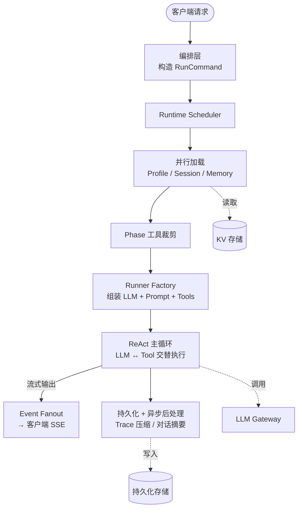
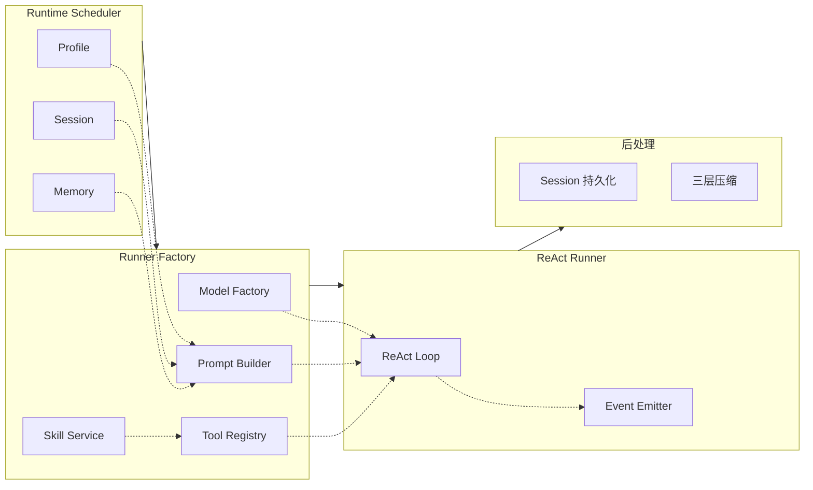
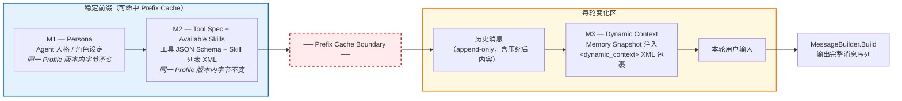
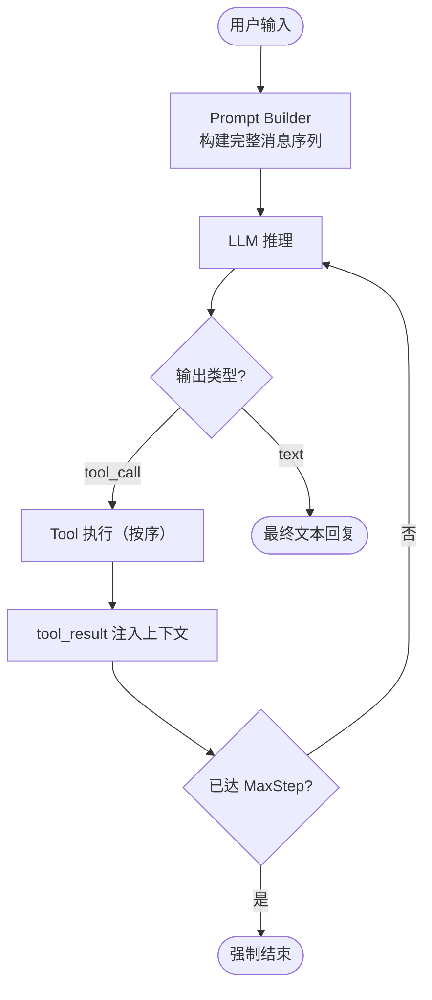
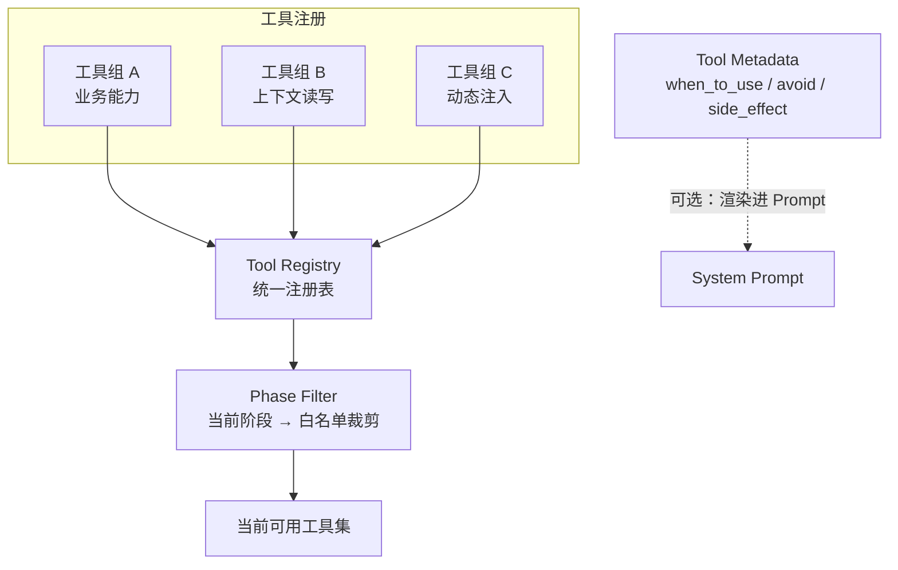
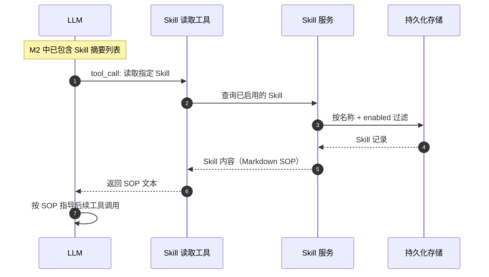
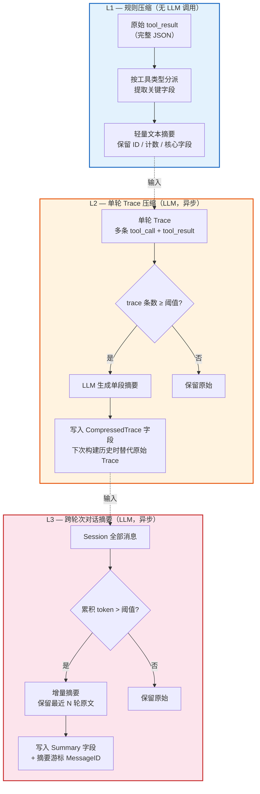
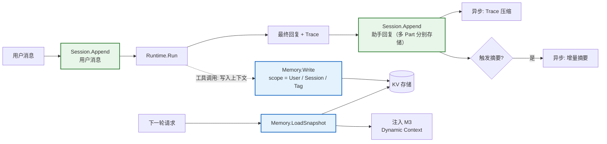
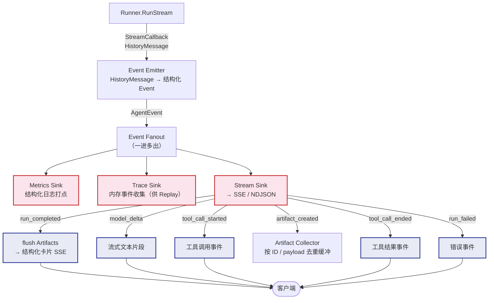
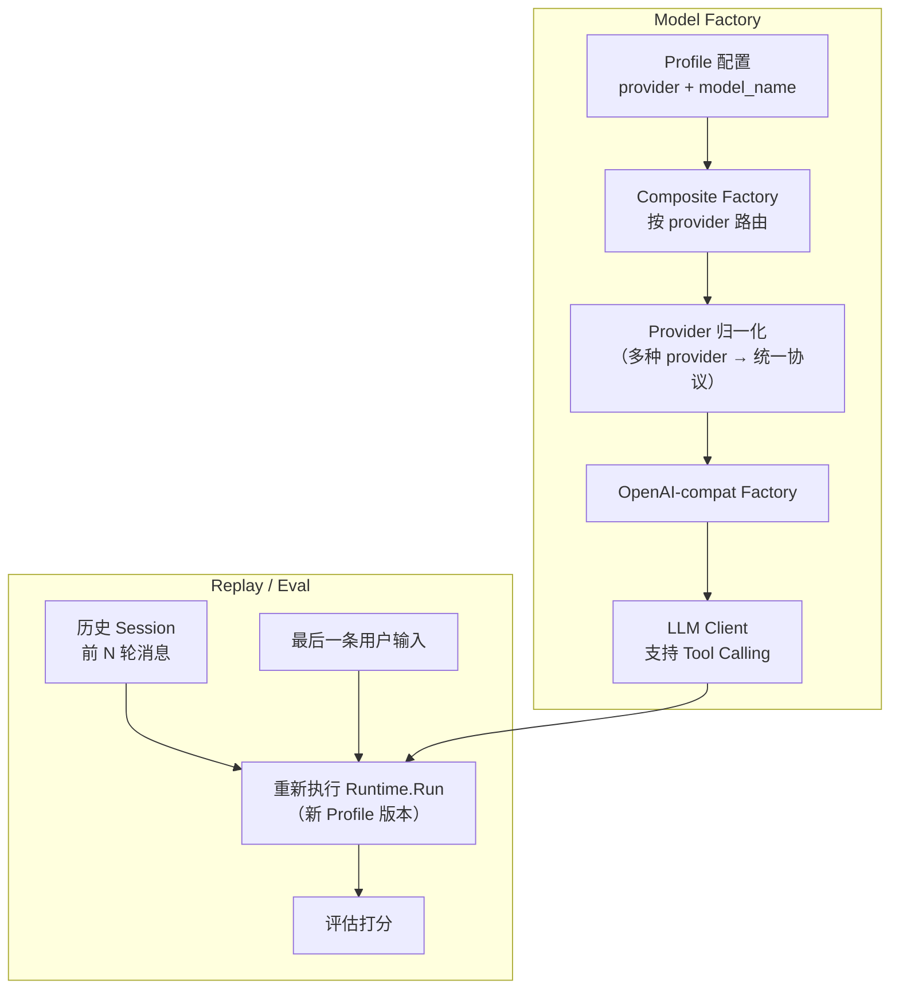

# Agent Runtime 架构（脱敏版）

> 仅展示架构模式。已脱敏：所有组件命名、目录结构、工具/Skill 具体职责。

## 总览：端到端主流程

## 组件关系：Runtime 内部结构

## Prompt 三段构建 + Prefix Cache 设计

**设计意图**：M1 + M2 构成稳定前缀，同一 Profile 版本内字节完全相同，可命中 LLM Provider 侧的 Prefix Cache 降低首 token 延迟。M3 以独立 system message 注入，不破坏缓存前缀。

## ReAct 主循环

## 工具系统

**关键模式**：
- **ReAct Loop**：LLM → tool_call → 执行 → 结果注入 → 再次推理，循环直到输出纯文本或达 MaxStep
- **Tool 按序执行**：工具调用不并行，保证状态一致性
- **Phase 过滤**：根据当前对话阶段裁剪可用工具白名单
- **Skill 按需加载**：LLM 在 Prompt 中看到 Skill 摘要列表，主动 tool_call 读取完整 SOP

## Skill 按需加载时序

## 三层历史压缩

**协同机制**：L1 在每次构建上下文时实时执行（纯规则，零延迟）→ L2 在每轮回复持久化后异步触发 → L3 在满足 token 阈值时异步触发。三层协同控制上下文窗口线性增长。

## Session + Memory 读写流

**关键设计**：
- **Session 多 Part 存储**：每条助手回复支持多个 Part，每个 Part 独立包含文本 + Trace，对应一次 ReAct 循环
- **Memory 双向流**：运行时通过工具写入 → 下一轮通过 Snapshot 加载注入 Prompt
- **异步后处理**：Trace 压缩和对话摘要均在主流程结束后异步执行，不阻塞响应

## 事件流 + Artifact 系统

**Artifact 双链路保障**：工具执行时可直接 emit 事件到前端流（快路径）；同时 Event Emitter 解析 tool_result 创建 Artifact，由 Stream Sink 在 `run_completed` 时统一 flush（兜底路径）。

## Model Factory + Replay

**Replay 用途**：复用历史 Session 的前 N 轮作为 context，重放最后一条用户输入，用于 Profile 版本对比和回归测试。
