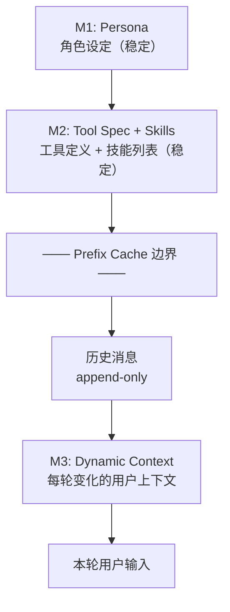
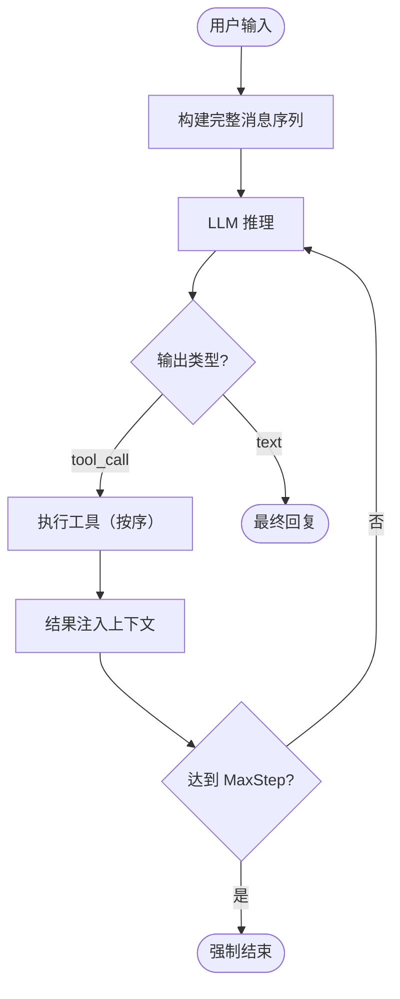
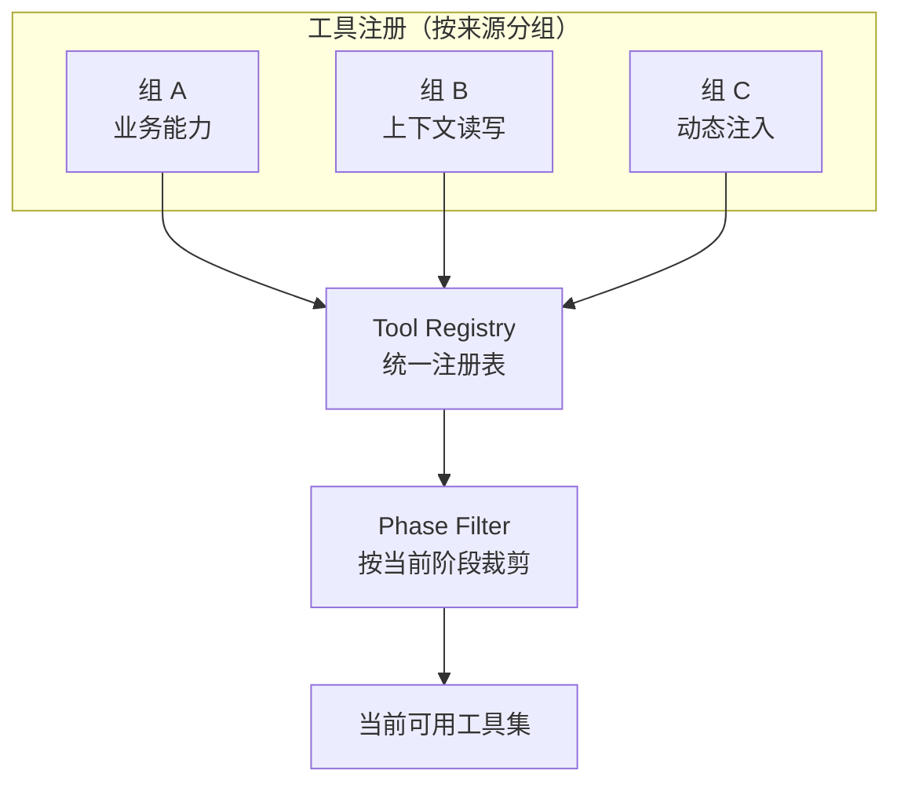
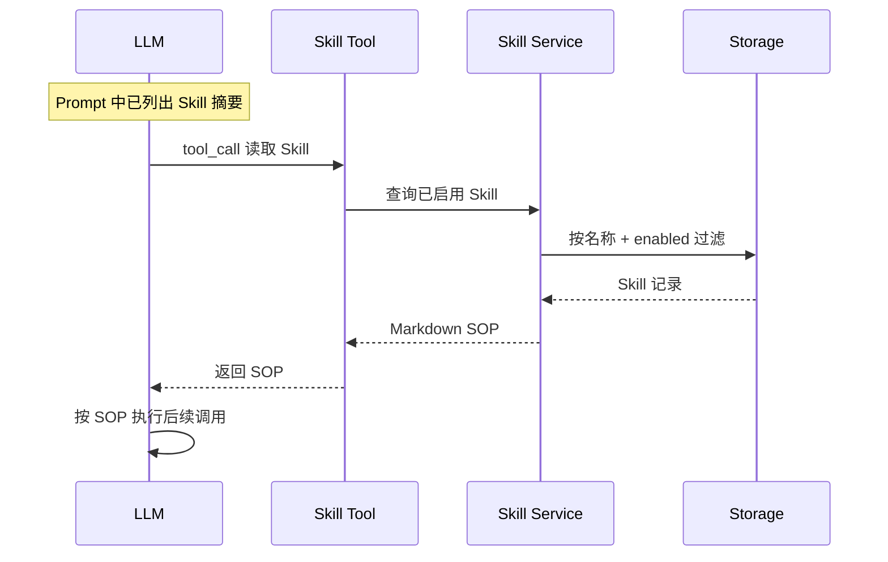
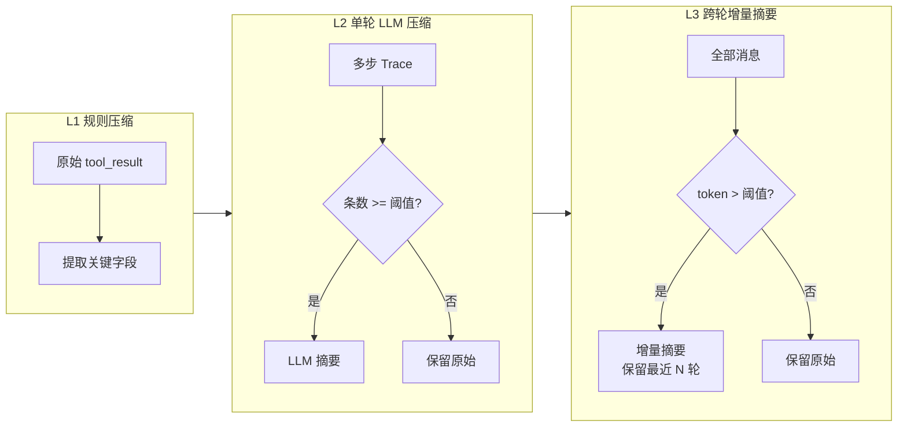
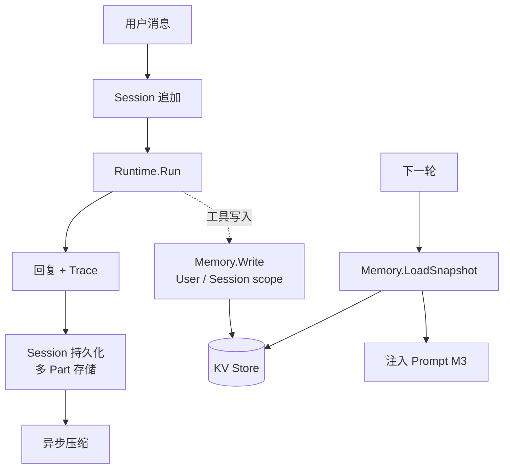

# Agent 架构小红书卡片内容稿

> 8 张卡片，每张包含：标题、Mermaid 源码（Card 2-7）或插画描述（Card 1/8）、洞察文字。

---

## Card 1 — 封面（baoyu 插画）

**标题**：一个生产级 Agent 从请求到回复经历了什么？

**内容要点**（供插画生成）：
- 一条请求从左到右经过 7 个阶段
- 编排 → 并行加载 → 阶段裁剪 → 依赖组装 → ReAct 循环 → 流式输出 → 异步压缩
- 强调 ReAct 循环是核心（最大的节点）
- 底部标注：LLM Gateway / 持久化存储 / KV 存储

**洞察**：请求进来后并行加载三份上下文，经阶段裁剪和依赖组装后进入 ReAct 循环，流式输出的同时异步压缩历史。

---

## Card 2 — Prompt 三段式 + Prefix Cache

**标题**：System Prompt 怎么设计才能命中 Prefix Cache？

**洞察**：M1 + M2 在同一 Profile 版本内字节完全不变，可命中 LLM Provider 的 Prefix Cache，首 token 延迟降低约 50%。M3 用独立 system message 注入，不破坏缓存前缀。

---

## Card 3 — ReAct 主循环

**标题**：Agent 的核心：推理 → 行动 → 观察

**洞察**：LLM 输出 tool_call 就执行，输出 text 就结束。MaxStep 是安全阀防止无限循环。工具按序执行不并行——状态一致性比吞吐更重要。

---

## Card 4 — 工具编排：注册 + 阶段过滤

**标题**：工具不是越多越好——Phase 白名单裁剪

**洞察**：工具按来源分三组注册到统一 Registry。运行时读取 Dynamic Context 中的 phase，做白名单裁剪：早期只开上下文工具，后期逐步解锁更多能力。工具元数据（when_to_use / avoid）可选渲染进 Prompt。

---

## Card 5 — Skill 按需加载

**标题**：LLM 自己决定要不要读 SOP

**洞察**：Prompt 里只放 Skill 摘要列表（省 token），LLM 判断需要时主动 tool_call 拉完整 SOP。懒加载 = 省 token + 精准匹配。Skill 支持 CRUD 管理，content hash 校验防重复写入。

---

## Card 6 — 三层历史压缩

**标题**：长对话不爆 context window 的三道防线

**洞察**：L1 纯规则零延迟，去冗余 JSON 只留关键字段。L2 异步触发，单轮多步 trace 压成一段话。L3 异步触发，远古历史压成增量摘要。三层协同把上下文增长从 O(n) 压到 O(log n)。

---

## Card 7 — Session + Memory 双向流

**标题**：Agent 怎么跨轮次记住用户？

**洞察**：Session 按轮次持久化，每条回复多 Part 存储（每 Part = 一次 ReAct 循环）。Memory 是结构化 KV，运行时通过工具写入 → 下一轮 Snapshot 注入 Prompt。两者配合 = 短期记忆 + 长期偏好。

---

## Card 8 — 结尾（baoyu 插画）

**标题**：8 个设计模式，一张图总结

**内容要点**（供插画生成）：
- 8 个关键设计点的一句话总结：
  1. Prompt 三段式 + Prefix Cache
  2. ReAct 推理-行动循环
  3. Phase 工具白名单裁剪
  4. Skill 懒加载（摘要 → 按需读取）
  5. 三层历史压缩（规则 → 单轮 LLM → 跨轮摘要）
  6. Session 多 Part + Memory KV 双向流
  7. 事件 Fanout 三通道
  8. Artifact 去重双链路
- 底部互动引导：你们的 Agent 用了哪些类似的模式？

**洞察**：这套架构的核心思路——把 LLM 当 CPU，Prompt 当指令集，工具当外设，Memory 当寄存器，Session 当磁盘，压缩当 GC。
