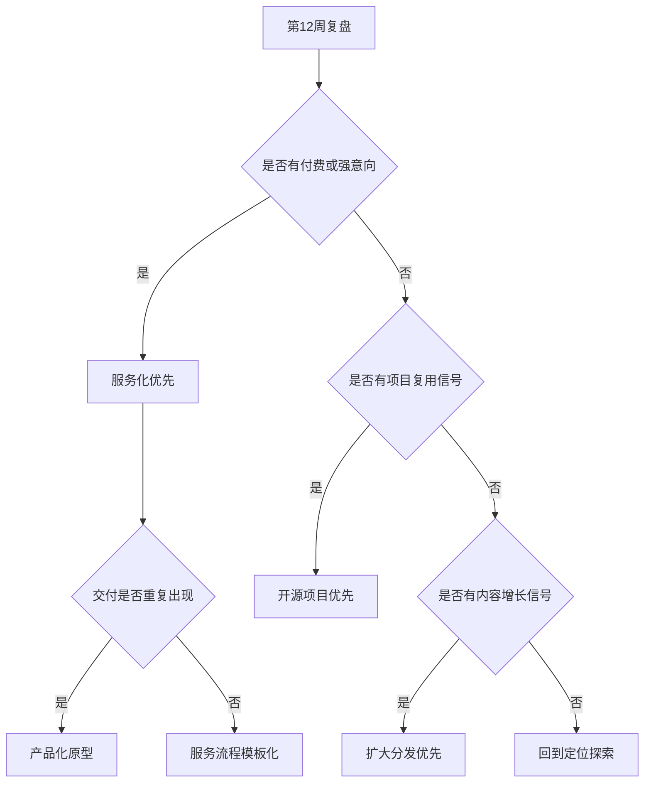

# Phase 4 Scale Decision

目标：第 13-16 周根据内容反馈、项目复用和付费信号决定下一步：产品化、服务化，还是继续扩大分发。

## 输入数据

第 12 周结束时，需要汇总以下数据。

### 内容数据

| 指标 | 数值 | 备注 |
|---|---:|---|
| 总发布内容数 |  |  |
| 高质量反馈内容数 |  | 评论、私信、转发、长收藏 |
| 最强内容支柱 |  | AI 工作流 / 知识系统 / 最小 offer |
| 最强平台 |  |  |
| 带来对话的内容 |  |  |

### 项目数据

| 指标 | 数值 | 备注 |
|---|---:|---|
| 已发布模板 / 项目数 |  |  |
| star / fork / clone / 下载 |  |  |
| issue / 评论 / 改进建议 |  |  |
| 真实试用人数 |  |  |
| 最强项目资产 |  |  |

### Offer 数据

| 指标 | 数值 | 备注 |
|---|---:|---|
| 目标用户对话数 |  |  |
| 强痛点对话数 |  |  |
| 愿意提供材料人数 |  |  |
| 问价人数 |  |  |
| 付费 / 强意向人数 |  |  |
| 最强 offer |  |  |

## 决策树



## 路径 A：服务化优先

选择条件：

- 至少 1 个付费或强意向。
- 至少 3 次对话指向同一个痛点。
- 你能在 1-2 次交付中产生明确结果。

第 13-16 周动作：

1. 固定主 offer，不再同时卖 3 个方向。
2. 把交付流程写成 checklist：访谈、材料收集、诊断、报告、复盘。
3. 找 3 个测试客户，用低价或案例价完成交付。
4. 每次交付后沉淀匿名案例和可复用模板。
5. 内容开始围绕案例写，而不是继续写抽象观点。

验收标准：

- 完成 2-3 次真实交付。
- 形成一份标准诊断报告模板。
- 能说清楚“适合谁 / 不适合谁 / 交付什么 / 多久完成 / 收多少钱”。

## 路径 B：开源项目优先

选择条件：

- 内容反馈一般，但模板、脚本或 repo 有复用信号。
- 有人提 issue、问用法、请求扩展。
- 需求更像“工具化”而不是“咨询化”。

第 13-16 周动作：

1. 选择一个最强项目，补 README、示例、安装 / 使用说明。
2. 做 3 个真实用例，而不是扩功能。
3. 为项目写 3 条内容：问题、使用场景、案例。
4. 观察是否有人愿意贡献、提需求或用于真实工作。
5. 如果需求集中，再考虑 hosted version 或 pro 版。

验收标准：

- 项目 README 让陌生人 10 分钟内能用起来。
- 至少 5 个真实用户试用。
- 至少 2 个外部反馈进入 backlog。

## 路径 C：扩大分发优先

选择条件：

- 内容明显有反馈，但付费和项目复用还弱。
- 读者对观点有共鸣，但问题还没有具体到可交付。
- 你还需要更多样本理解受众。

第 13-16 周动作：

1. 固定 2 个内容支柱，暂停最弱支柱。
2. 每周发布 3 条短内容 + 1 条长内容。
3. 把最强内容改写到不同平台。
4. 每条内容加一个轻量行动入口：评论关键词、填表、约聊、试用模板。
5. 每周至少主动发起 2 次对话。

验收标准：

- 4 周内至少 12 条内容。
- 至少 5 次由内容触发的对话。
- 至少 1 个 offer 或项目方向变得更清楚。

## 路径 D：产品化原型

选择条件：

- 已有付费或强意向。
- 多次交付中重复出现同一类问题。
- 交付物中有一部分可以标准化或自动化。
- 用户愿意反复使用，而不是一次性咨询。

第 13-16 周动作：

1. 不做完整 SaaS，只做最小产品原型。
2. 原型只解决一个重复问题，例如工作流检查、诊断报告生成、模板推荐、复盘追踪。
3. 先用手工 + 文档 + 脚本交付，再决定是否做界面。
4. 绑定 3 个测试用户，观察他们是否每周使用。
5. 只在重复使用成立后，才考虑收费产品。

验收标准：

- 3 个测试用户完成 onboarding。
- 至少 2 个用户重复使用 2 次以上。
- 产品能减少你服务交付中的一个明确步骤。

## 第 16 周最终输出

第 16 周写一份决策文档：

```markdown
# 16 Week Decision Review

## 最终选择

- 主路径：
- 备选路径：
- 暂停路径：

## 证据

### 内容证据

### 项目证据

### Offer / 付费证据

## 未来 8 周计划

- 内容：
- 项目：
- 变现：
- 需要停止的事：

## 当前定位

一句话定位：

目标受众：

核心痛点：

交付方式：

收费假设：
```

## 默认建议

如果第 12 周已经出现付费或强意向，优先走服务化。服务是这个阶段最快的学习方式，因为它能暴露真实需求、交付成本、客户语言和可产品化部分。

如果没有付费，但开源模板有明显复用，优先把开源项目做扎实。它会成为你的信任资产和获客入口。

如果内容有反馈但没有具体需求，继续扩大分发，但每条内容都要带行动入口。纯表达不能无限延长，必须逐步把读者引向对话、模板或 offer。
